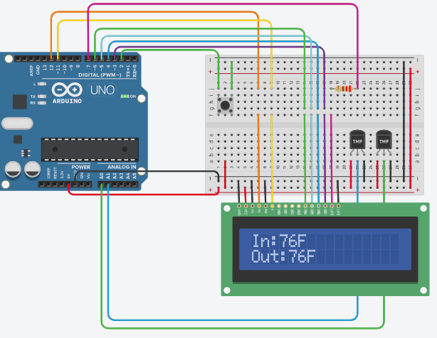

# Arduino Temp Compare
Arduino Program that displays the temperature on two digital thermometers on an LCD display and lights up if the temperature on one sensor becomes greater or less than the other.

In the heat of the summer, I would check the thermometer outside all morning for when it started to be hotter outside and I needed to turn off the box fan and close the windows and blinds to preserve the cool indoor temperature. I'd then repeat the process in reverse each evening. Wiring two thermometers to an arduino with this little program, I can see both temperatures in one spot and get a visual cue of a fading in and out light when the temperature has swapped so I don't miss it and spend more time in a baking apartment than necessary. 

## Getting Started 

* Wire hardware and load TempSensor.ino with your favorite Arduino IDE
* Adjust how long the LCD brightness fades in and out after a temperature swap has been detected by setting the value of AlertPeriod, line ~57
* Load on to Arduino

Press button to switch between Celsius and Fahrenheit

### Dependencies
**Included** 
* **LiquidCrystal.h**
* **Print.h**
* inttypes.hs
* stdio.h
* WString.h
* Printable.h

### Hardware Required
* Arduino Board
* 2 Analog Temperature Sensors
* 1 16x2 LCD Display
* 1 button
* 220 ohm Resistor
* Wires
* Breadboard

### Wiring Diagram

## Try It Out
To test the application online create a TinkerCad account, click the link below and select "Copy and Tinker".

[TinkerCad Arduino Temp Compare](https://www.tinkercad.com/things/heJVZbuhrdK)
